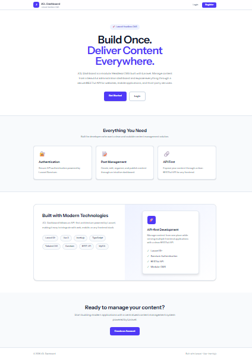
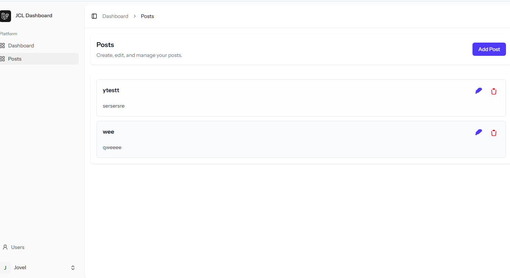

# 🚀 JCL Dashboard- Laravel CMS Dashboard (Headless)

A modular, headless Content Management System (CMS) built with **Laravel**, designed to manage content via an intuitive admin dashboard and expose it through a clean **RESTful API** for use across web, mobile, or other platforms.

---

## 🧱 Features

- 🔐 Authentication (Sanctum)
- 📝 Post Management
- 🔗 API-first Architecture

---

## 🖼️ Screenshots

<div align="center">

<h3>📊 Landing Page</h3>


<h3>📝 Post Management</h3>


</div>

## 📦 Tech Stack

- **Backend**: Laravel 13+
- **Database**: MySQL
- **Authentication**: Laravel Sanctum
- **API Docs**: [Postman Collection](https://jovelluna12-3893529.postman.co/workspace/Jovel-Christer-Luna's-Workspace~3c2c5987-9739-481f-8457-e6e9e4becf20/collection/48789645-42ddfe6b-ea36-45ed-8b74-9a30282d446f?action=share&creator=48789645)

---

## 🚀 Getting Started

### Prerequisites

- PHP >= 8.2
- Composer
- Node.js & NPM
- MySQL
- Laravel CLI

### Installation

```bash
# Clone the repo
git clone https://github.com/jovelluna12/jcl-dashboard.git

cd yourprojectname

# Install dependencies
composer install
npm install && npm run build

# Copy env and generate key
cp .env.example .env
php artisan key:generate

# Set up database
php artisan migrate --seed

# (Optional) Install storage link
php artisan storage:link

# Start Frontend Server
npm run dev

# Start server
php artisan serve


